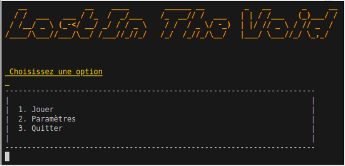
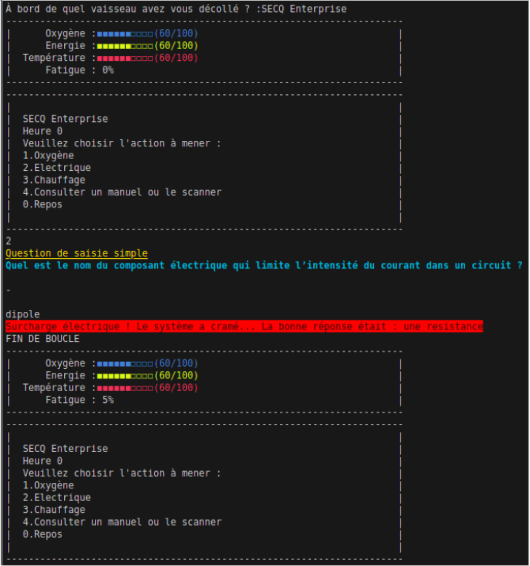
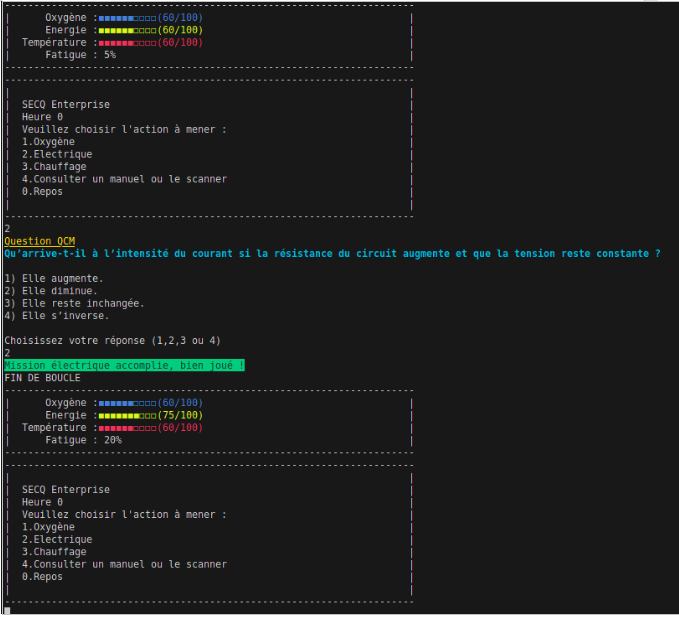

## Présentation du jeu

**Titre du jeu** : Lost In The Void

Le joueur est le capitaine d’un vaisseau spatial qui se retrouve perdu dans l’espace. 
En attendant que des secours viennent l’aider, il lui faut gérer les ressources nécessaires à sa survie, 
tels que l’électricité, l’oxygène et la température pendant un certain nombre d’heures. Ce jeu est un jeu 
ludo-pédagogique, car pour maintenir ses niveaux de ressources, il lui faut répondre à des questions d’électricité,
de chimie ou de physique ou de culture générale autour de l’espace pour quelques actions supplémentaires,
comme des révisions sur les thèmes donnés.

## Description du projet

Ce projet a été réalisé en un langage de programmation nommé iJava, une version de Java simplifiée, sans notion de 
programmation orientée objet. C'est un jeu jouable via un terminal, ici par exemple avec le terminal de Visual Studio Code.

## Compàétences

* Programmation
  * Compréhension des structures principales de programmation
  * Gestion de la persistance et l'externalisation de données
  * Gestion des saisies, protection contre des erreurs.
  * utilisation de types et structures personnalisées
* Premiere utilisation de Git
* premier projet utilisant un IDE, ici VSCode

