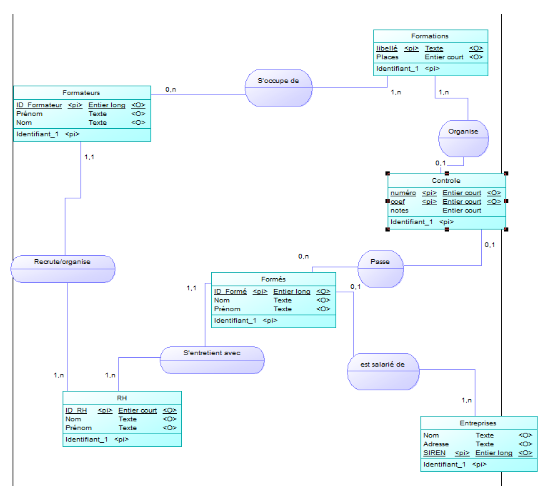
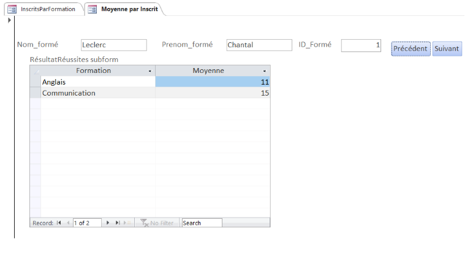

## Présentation du projet

### Résumé du projet(en 10 lignes)

Ce projet consistait en la conception d'une base de données dans le cadre d'un thème décidé. 
Ici le thème était la base d'une donnée d'un organisme de formation. Il fallait donc penser aux besoins 
d'une telle organisation, créer les entités nécessaires et s'interroger sur les liens possibles entre 
chacun d'eux, créer un jeu de données pour expliquer son fonctionnement, créer des formulaires, vues et 
requêtes pour utiliser cette base de donnée. Avec cela était joint une partie économique à ce projet, qui 
consistait en l'analyse du marché d'une entreprise fictive s'inscrivant dans notre thème.

### visuels liés au projet

## Qualités demandées et acquises

### Compétences et Savoir-Faire informatique

- Utilisation de Power AMC
    - Créer un Modèle Conceptuel de Données.
    - Créer un Modèle Logique de Données.
- Utilisation de Microsoft Access
    - Créer une base de données.
    - Créer des requêtes.
    - Créer des vues.
    - Créer des formulaires.

### Savoir-Être

- Savoir gérer de façon pertinente et claire des données différentes en nature et destination.

### Savoir Faire autres qu'informatique

- Savoir analyser une entreprise dans son marché.
- Savoir chercher des ressources fiables et spécialisées.
