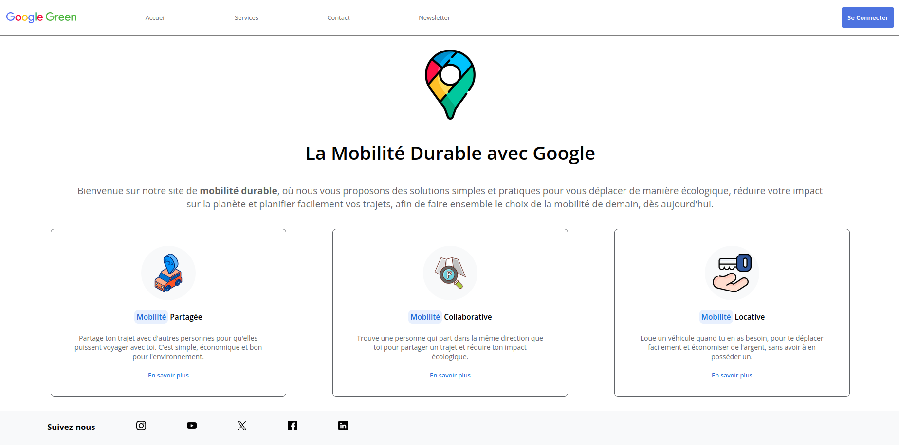
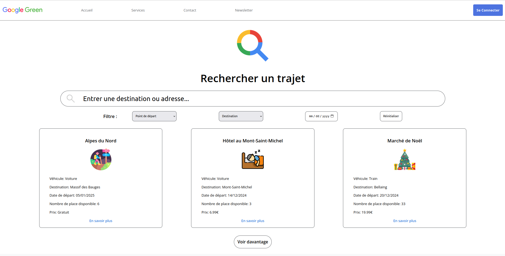
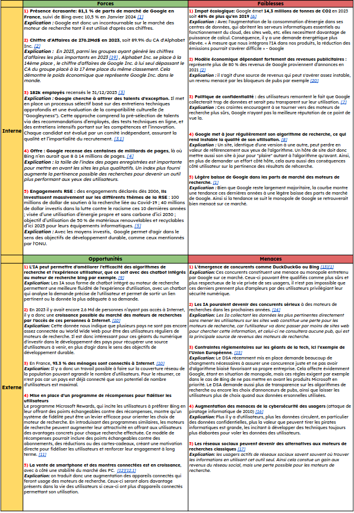

## Présentation du projet

Les Situations d’Apprentissage et d’Évaluation de Recueil de besoins et de
Découverte de l’environnement économique consistent en plusieurs projets sollicitant
des compétences très différentes d’une partie à l’autre. Organisés en trinômes, nous
devions faire de notre sujet une entreprise liée à la technologie ou à Internet de
façon plus ou moins claire. Pour notre groupe, nous avions choisi l’entreprise Google.
Une partie économique consistait en l’analyse stratégique de l’entreprise et de son
emplacement dans le marché. Une partie développement d’interface web nous a
permis de monter un site dans l’objectif de concevoir un service de location de
moyens de transports et de réseau de covoiturage interne à cette entreprise, suivi
d’une partie communication dont l’objectif était la publication d’une newsletter
destinée aux employés concernant la mise à disposition dudit service.

## Visuel de notre projet

## Résumé de notre projet

### (Objectifs, ressources et connaissances) mobilisées et requises

L’objectif principal de ce projet était avant tout une mise en coopération du trinôme dans
l’optique de se répartir les tâches à partir d’un socle commun, déterminé par le choix de
l’entreprise. Il nous fallait donc comprendre l’entreprise, comment elle fonctionne et surtout
quelles sont les caractéristiques faisant son attractivité visuelle, et agir de sorte à mener des
missions variées dans un laps de temps défini. Le projet en premier lieu partait de la partie
économie. Cette partie consistait en la présentation de l’entreprise choisie et puis en
l’analyse stratégique de l’entreprise, de sa place dans le marché des moteurs de recherche
sous la forme d’un SWOT, donc un diagramme présentant les faiblesses et forces d’une
entreprise, ainsi que les menaces et opportunités concernant son marché d’activité. La
partie web, elle, consistait d’abord en la réflexion des fonctionnalités à implémenter pour la
mise en place d’un tel service au travers de maquettes, puis en l’application de nos
connaissances en html et css pour mettre en forme ce dispositif en reproduisant la charte
graphique de l’entreprise choisie. Enfin la partie newsletter s’était organisée à la fin du projet
par une rédaction personnelle d’une newsletter, la mise en commun avec le trinôme puis sa
publication via l’outil Brevo.

### Compétences techniques et savoir-faire informatiques visées par le projet

- Construction d’un site web.

- concevoir son interactivité.

- prévoir une utilisation par tout type de personne, incluant les personnes atteintes de
  handicap visuel.

- entretenir une cohérence visuelle, avoir un style clair et cohérent de page en page.

### Livrables

#### Livrables liés à l’informatique

Archive en .zip jointe au rendu.
= Document ou lien vers la preuve : (GITHUB ou autre)

#### Livrables différents du domaine de l’informatique

= Document ou lien vers la ou les preuves : (GITHUB ou autre)

#### Savoir-être requis

- savoir coopérer, connaître les forces et faiblesses de chacun pour l’orientation des
  tâches.
- orienter ce que l’on fait dans l’optique de le montrer à différents publics : tout type de
  personne pour le site web, un public constitué de partenaires professionnels pour la
  newsletter.

### Savoir-faire autres qu’informatique

- Sélectionner des sources adéquates et croiser ces sources pour dégager une
  certaine crédibilité dans les informations données.
- Savoir mener une analyse complète et globale d’une entreprise, et étendre l’analyse
  au marché dans sa globalité.
- Être persuasif dans la vente d’un nouveau service auprès d’un public cible.
