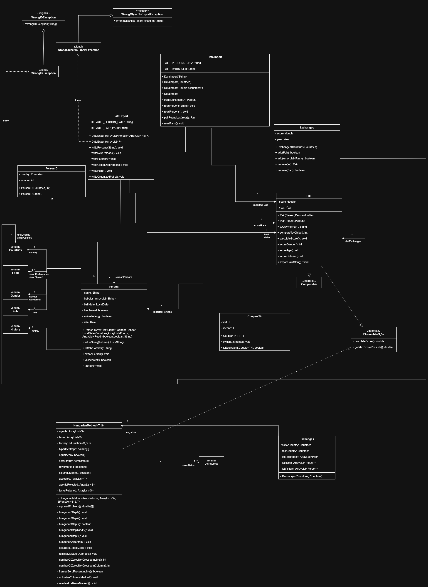
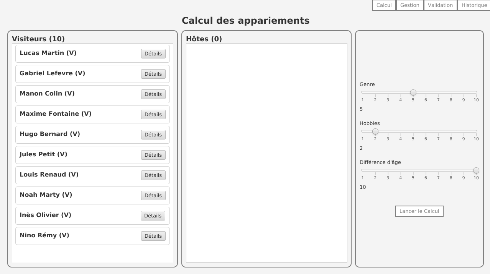

## Présentation du projet

### Résumé du projet

Cette SAÉ était un projet pluri-disciplinaires, faisant intervenir 3 ressources : Le développement orienté objet, l'introduction à l'intéraction Humain-Machine et Graphes. Nous avions un thème commun, à savoir la conception d'une plateforme d'échanges internationaux entre adolescents, et avions à fournir des livrables différents selon la ressource : Une conception programmatique de la gestion des échanges, avec gestion des entrées et sorties et d'externalisation/sauvegarde des données, conception d'une interface suivant le thème respectant des contraintes données, et une mise au point d'un équilibrage dans le traitement des informations entre deux étudiants, à savoir comment prendre en compte les points communs et leur importance et les incompatibilités qu'il peut exister, comme les allergies.

### (visuels)

## Qualités demandées et acquises

### Compétences et Savoir-Faire informatique

- Développement en Java :
    - Développement général de classes
    - Création d'une JavaDoc
    - Gestion d'exceptions et des entrées/sorties
    - Concevoir une politique de tests de fonctionnalités
- Développement en JavaFX:
    - création de prototypes basse et haute fidélité
    - gestion des évènements
    - prise en compte des critères ergonomiques et des principes de la Gestalt.

### Savoir-Être

- Être collaboratif, prendre en compte les points forts et faibles de chacun pour répartir les efforts.
- Savoir partager aux membres de son équipe mes avancées et faire en sorte qu'ils puissent comprendre et se servir des mes ajouts.

### Savoir Faire autres qu'informatique

- rédaction de pseudo-code.
- représentation d'un projet informatique via la conception d'un diagramme UML.
- Modélisation mathématique et exploitation algorithmique.

## Mon bilan personnel rédigé

### Mes points forts

- Mes compétences mathématiques et logiques m'ont beaucoup aidé pour la partie Graphes et l'écriture de l'algorithme de Kuhn-Munkres en Java.
- Mon implication pour le projet.

### Mes difficultés

- Problèmes de communication avec mes collaborateurs.
- Difficultés d'emploi du temps : job étudiant à ~20h/semaine, ce qui pouvait m'empêcher certaines fois de travailler sur ce projet.

### Mes points à améliorer

- Clarté du code et de la description de celui-ci pour que mes collaborateurs puissent comprendre pus facilement ce que j'ai fait.
- Exploitation du cours d'IHM, beaucoup d'améliorations possibles à apporter à l'IHM.
- Quelques choix en début de partie Graphe qui ont eu un mauvais impact sur la fin lors de la partie d'équilibrage entre affinité et incompatibilité.

## Conclusion

(Mon degré d’implication, mon degré d’autonomie, mon interaction avec les autres
membres de l’équipe ? Si c’était à refaire, qu’est- ce que je changerais ? Quels
objectifs puis-je me donner pour le BUT 2 ? Quels moyens mettre en œuvre pour les
atteindre ? Est-ce que cette Saé a eu une influence sur mon projet personnel ?)

Mon degré d'implication est je pense un de mes points forts lors de ce projet, en particulier compte tenu de mes contraintes dûes à mon travail à côté : j'ai dû assumer l'entièreté de la partie Graphes, j'ai apporté la majorité des idées et des réflexions en Dev OO et IHM, bien que n'étant pas le membre le plus fort du trinôme, parce que j'étais le plus impliqué dedans, et ai souvent dû veiller tard pour assurer les rendus de chaque étape du projet. Si le projet était à refaire, je distribuerai mieux les tâches et m'assurerai de l'implication de mes collaborateurs sur nos objectifs. Ce projet m'a cependant permis de découvrir de nouveaux outils et de nouvelles notions (en particulier sur l'interactivité) et m'a donné envie pour cet été de découvrir de nouveaux langages, comme le C++ et le C#.

